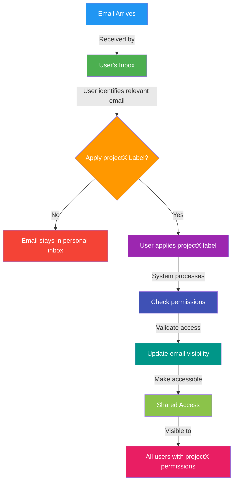
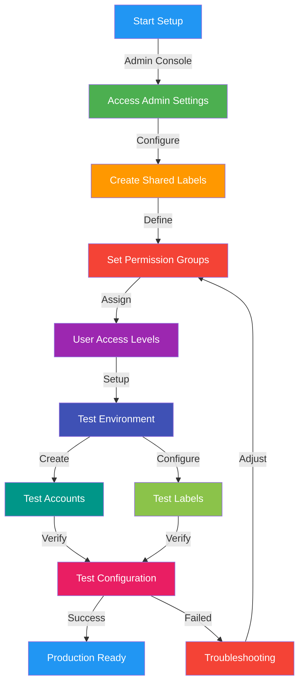

# Shared Labels in Google Workspace: Email Sharing Guide

# Repository
https://github.com/pleabargain/shared-labels-in-google-workspace-domain

## to the developer
It's very important the developer has access to their own Google Workspace account to test their script.

## Technical Requirements
- Clear visualization of email sharing workflow
- Accurate representation of system interactions
- Easy-to-follow process flow
- Proper permission management implementation
- Secure access control mechanisms

## Prerequisites & Permissions

### Administrator Requirements
- Google Workspace administrator access
- Ability to manage organizational units
- Access to Google Admin Console
- Rights to configure Gmail settings

### User Requirements
- Google Workspace account
- Membership in appropriate user groups
- Access to specific project labels
- Permission to apply/remove shared labels

## Testing Environment Setup
1. Required Test Accounts:
   - Administrator account
   - Test sender account(s)
   - Test recipient account(s)

2. Test Label Configuration:
   - Create dedicated test labels
   - Set up test project groups
   - Configure varying permission levels

3. Verification Steps:
   - Validate admin permissions
   - Confirm user access levels
   - Test label visibility
   - Verify email sharing functionality

## Overview
This guide explains how to use shared labels in Google Workspace to efficiently share emails with team members without the need for manual forwarding. The system uses label-based permissions to make emails accessible to authorized users while maintaining organization and security.

## How It Works

## Step-by-Step Instructions

### Setting Up Shared Labels
1. Contact your Google Workspace administrator to set up shared labels
2. Ensure you have the necessary permissions for the project labels you need
3. Verify that other team members have appropriate access to shared labels

### Sharing Emails
1. When you receive an email that should be shared:
   - Open the email in your inbox
   - Look for the label icon or right-click the email
   - Select or create the appropriate project label (e.g., "projectX")
   - Apply the label to the email

2. The system will automatically:
   - Verify permissions
   - Update email visibility
   - Make the email accessible to authorized team members

### Accessing Shared Emails
1. Team members can view shared emails by:
   - Clicking on the shared label in their Gmail sidebar
   - Using Gmail search with the label: operator (e.g., `label:projectX`)
   - Browsing all emails tagged with the project label

## Benefits
- **Eliminate Manual Forwarding**: No need to forward emails individually
- **Maintain Organization**: Emails are automatically categorized by project
- **Ensure Security**: Only authorized users can access shared emails
- **Improve Collaboration**: Team members have immediate access to relevant communications
- **Reduce Inbox Clutter**: Emails stay organized with project-specific labels

## Best Practices
1. Apply labels consistently to maintain organization
2. Use descriptive label names that clearly indicate the project or purpose
3. Regularly review and clean up shared labels
4. Only share emails that are relevant to the project
5. Remove labels from emails that no longer need to be shared

## Important Notes
- Emails remain in your personal inbox even when shared
- Removing a label will remove access for other team members
- Users must have appropriate permissions to view shared emails
- The original sender and recipients remain unchanged

## Setup Process Flowchart

## Troubleshooting Guide
1. Permission Issues
   - Verify user is in correct groups
   - Check label permissions
   - Confirm admin settings
   - Review access logs

2. Label Visibility Problems
   - Clear browser cache
   - Refresh Gmail
   - Check label sync status
   - Verify label permissions

3. Email Sharing Issues
   - Confirm label application
   - Check recipient permissions
   - Verify email visibility settings
   - Review sharing policies

## Support
Contact your Google Workspace administrator for:
- Setting up new shared labels
- Adjusting permissions
- Troubleshooting access issues
- Training and additional support
- Permission group configuration
- Access control modifications
- System audit requests

## Security Considerations
- Only apply shared labels to emails that should be visible to the entire project team
- Be mindful of sensitive information when sharing emails
- Regularly review shared email access to ensure appropriate visibility
