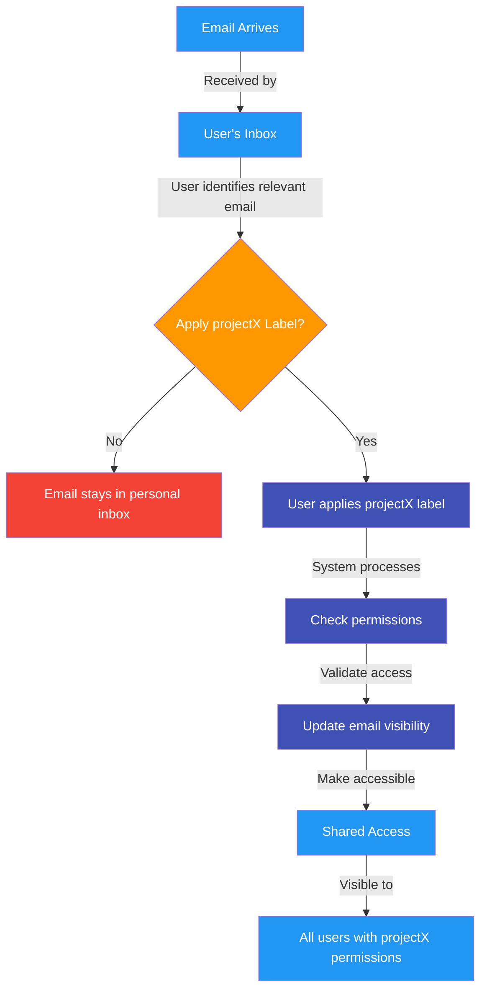

# Email Sharing via Shared Labels in Google Workspace

This flowchart illustrates the process of sharing emails using shared labels in Google Workspace:

1. Initial Email Reception
   - Email arrives in user's inbox
   - Only visible to original recipient

2. Label Application Process
   - User decides whether to apply projectX label
   - If no label is applied, email remains private
   - User applies projectX label to share

3. System Processing
   - System checks user permissions
   - Updates email visibility settings
   - Makes email accessible to authorized users

4. Shared Access
   - Email becomes visible to all users with projectX permissions
   - Maintains organized project-based email sharing
